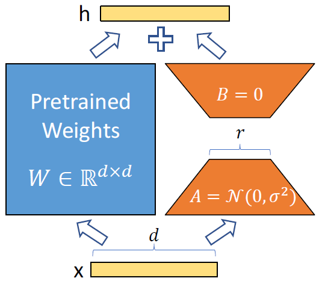
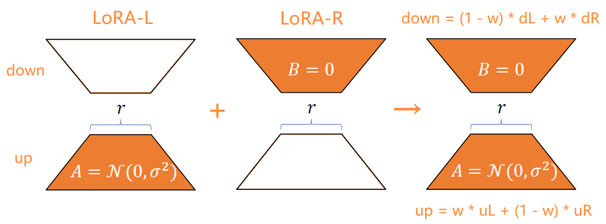

# stable-diffusion-webui-lora-zip

    Fuse two LoRAs in a matrix-zip way, extension script for AUTOMATIC1111/stable-diffusion-webui.

----

<p align="left">
  <a href="https://github.com/Kahsolt/stable-diffusion-webui-lora-zip/commits"></a>
  <a href="https://github.com/Kahsolt/stable-diffusion-webui-lora-zip/issues"></a>
  <a href="https://github.com/Kahsolt/stable-diffusion-webui-lora-zip/stargazers"></a>
  <a href="https://github.com/Kahsolt/stable-diffusion-webui-lora-zip/network"></a>
  
  
  <br/>
</p>


⚠ 我们成立了插件反馈 QQ 群: 616795645 (赤狐屿)，欢迎出建议、意见、报告bug等 (w  
⚠ We have a QQ chat group (616795645) now, any suggestions, discussions and bug reports are highly wellllcome!!  

**NOTE: Lora-Zip is NOT the ZipLora: [https://ziplora.github.io/](https://ziplora.github.io/)**, their method is actually more reasonable, and mine is a chaotic toy :(


### Change Log

⚪ Features

- 2023/11/18: `v1.0` init version


### Examples

Example run configure:

```
model = animesfw-final-pruned.ckpt [22fa233c2d]
prompt = ((masterpiece)), highres, ((boy)), child, cat ears, white hair, red eyes, yellow bell, cloak, barefoot, angel, [flying], egyptian
neg_prompt = (((nsfw))), ugly,duplicate,morbid,mutilated,tranny,trans,trannsexual,mutation,deformed,long neck,bad anatomy,bad proportions,extra arms,extra legs, disfigured,more than 2 nipples,malformed,mutated,hermaphrodite,out of frame,extra limbs,missing arms,missing legs,poorly drawn hands,poorty drawn face,mutation,poorly drawn,long body,multiple breasts,cloned face,gross proportions, mutated hands,bad hands,bad feet,long neck,missing limb,malformed limbs,malformed hands,fused fingers,too many fingers,extra fingers,missing fingers,extra digit,fewer digits,mutated hands and fingers,lowres,text,error,cropped,worst quality,low quality,normal quality,jpeg artifacts,signature,watermark,username,blurry,text font ufemale focus, solo female, poorly drawn, deformed, poorly drawn face, (extra leg:1.3), (extra fingers:1.2),out of frame
sampler = Euler a
size = 512 x 512
steps = 20
cfg = 7
seed = 114514
clip skip = 1

COMMANDLINE_ARGS=--no-half-vae --xformers
```

LoRAs used in below examples:

- LoRA-L: []()
- LoRA-R: []()

⚪ originals

| LoRA-L | no LoRA | LoRA-R |
| :-: | :-: | :-: |
|  |  |  |

⚪ Up/Down weight

| w=0.0 | w=0.25 | w=0.5 | w=0.75 | w=1.0 |
| :-: | :-: | :-: | :-: | :-: |
|  |  |  |  |  |

ℹ fix `Multiplier weight = 0.5`

⚪ Multiplier weight

| v=0.0 | v=0.25 | v=0.5 | v=0.75 | v=1.0 |
| :-: | :-: | :-: | :-: | :-: |
|  |  |  |  |  |

ℹ fix `Up/Down weight = 0.5`


### How it works?

| LoRA | LoRA-Zip |
| :-: | :-: |
|  |  |


### Installation

Easiest way to install it is to:
1. Go to the "Extensions" tab in the webui, switch to the "Install from URL" tab
2. Paste https://github.com/Kahsolt/stable-diffusion-webui-lora-zip.git into "URL for extension's git repository" and click install
3. (Optional) You will need to restart the webui for dependencies to be installed or you won't be able to generate video files

Manual install:
1. Copy this repo folder to the 'extensions' folder of https://github.com/AUTOMATIC1111/stable-diffusion-webui
2. (Optional) Restart the webui

----
by Armit
2023/10/08 
